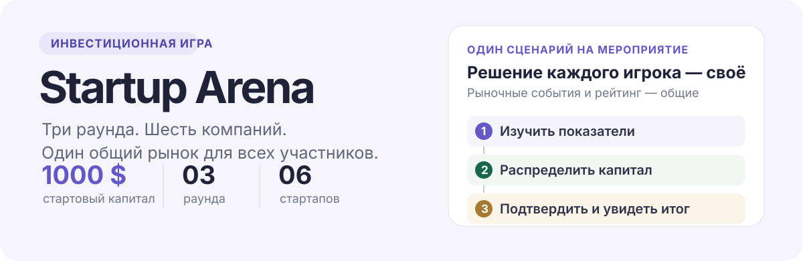

<p align="center">
  
</p>

<p align="center"><strong>Учебная инвестиционная игра для мероприятий</strong></p>
<p align="center">Изучайте компании, распределяйте капитал и сравнивайте решения в общем рейтинге.</p>

## Игровой цикл

1. **Изучите рынок:** показатели и новости шести вымышленных компаний.
2. **Распределите капитал:** каждый игрок начинает с 1000 $ и решает, сколько вложить, а сколько оставить свободными.
3. **Подтвердите решение:** сервер рассчитывает итог и показывает событие завершившегося раунда.
4. **Сравните результат:** после трёх раундов итог участника попадает в общий сохраняемый рейтинг.

Несколько участников могут играть одновременно в отдельных браузерах. В рамках одного мероприятия у всех один и тот же скрытый сценарий, поэтому результаты можно сравнивать.

## Шесть компаний

| Компания | Отрасль |
| --- | --- |
| NovaMind | Программы для бизнеса |
| MedFlow | Здравоохранение |
| VoltX | Энергетика |
| GreenBox | Упаковка и логистика |
| AgroPulse | Агротехнологии |
| OrbitLink | Спутниковая связь |

## Возможности

- Распределение сумм вручную, быстрыми шагами, процентами или поровну.
- История показателей, новости и результат каждого раунда.
- Сессии игроков независимы; завершённые игры и рейтинг хранятся в SQLite.
- Интерфейс на русском и английском языках.
- Кабинет организатора: управление мероприятием, экспорт рейтинга и резервная копия данных.
- Награждение трёх лучших участников и итоговый рейтинг после закрытия мероприятия.

## Локальный запуск

Нужны Node.js 22.12 или новее и npm.

```bash
npm ci
test -f .env || cp .env.example .env
```

Откройте `.env` и задайте собственный `ORGANIZER_PASSWORD`. Затем соберите проект и запустите сервер:

```bash
npm run build
npm start
```

Игра будет доступна по адресу <http://127.0.0.1:3001>. Для разработки запустите `npm run dev`; Vite покажет адрес клиентского интерфейса.

## Технологии и модель

- Клиент: React, TypeScript, Vite.
- Сервер: Node.js, TypeScript, Express.
- Хранение: SQLite; суммы рассчитываются сервером в целых центах.
- Рынок строится по заранее подготовленным данным и явным формулам. Будущие события и доходности не отправляются клиенту заранее.

Это образовательная симуляция, а не прогноз доходности или рекомендация инвестировать. Компании и события вымышлены.

## Документация

- [Решения проекта](DECISIONS.md) · [Спецификация](PRODUCT_SPEC.md) · [Правила игры](GAME_RULES.md)
- [Математическая модель](MATHEMATICAL_MODEL.md) · [Сценарии](SCENARIOS.md) · [Архитектура](ARCHITECTURE.md)
- [Проверки](TESTING.md) · [План реализации](IMPLEMENTATION_PLAN.md)

## Лицензия

MIT — см. [LICENSE](LICENSE).
