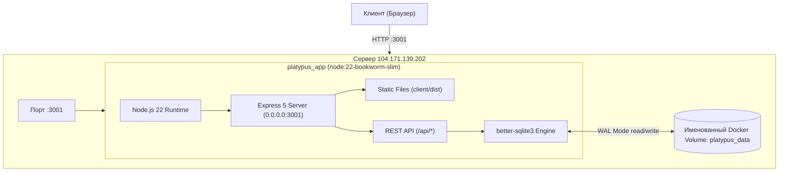

# Архитектурный дизайн развертывания проекта «Startup Arena» на Linux-сервере

**Дата:** 2026-10-02  
**Целевой хост:** `104.171.139.202` (пользователь `clubfest`)  
**Метод развертывания:** Docker & Docker Compose (Multi-stage build)

---

## 1. Введение и цели

Проект `platypus_fucker` представляет собой монорепозиторий веб-симулятора инвестиций (React 19 + TypeScript + Vite на клиенте, Express 5 + Node.js 22 + `better-sqlite3` на сервере). 
Цель — подготовить проект к контейнеризации и развернуть изолированный production-инстанс на удаленном Linux-сервере с постоянным хранилищем базы данных SQLite, доступным по внешнему сетевому порту.

---

## 2. Результаты предварительного аудита целевого сервера

Аудит сервера `104.171.139.202`, проведенный тремя специализированными субагентами, зафиксировал следующие параметры:
1. **Операционная система:** Ubuntu 22.04.5 LTS (x86_64, Linux kernel 5.15).
2. **Аппаратные ресурсы:** 2 vCPU, 3.8 GiB RAM (доступно 2.8 GiB), свободное дисковое пространство на `/` (ext4) — **32 GiB**.
3. **Docker-окружение:**
   - Docker Engine `29.2.1` активен, драйвер хранилища `overlayfs`.
   - Docker Compose `v5.0.2` (плагин `docker compose`) активен.
   - Пользователь `clubfest` состоит в группе `docker` (`gid=998`) и может выполнять сборку и запуск контейнеров без `sudo`.
4. **Сетевой ландшафт:**
   - Порты 80 и 443 заняты системным демоном Nginx (обслуживает сторонние проекты `*.timbqs.ru`).
   - Порт 3000 занят сервисом `conet-backend`.
   - **Порт 3001 свободен** и готов для приема внешних соединений.
   - Фаервол UFW отключен (`ENABLED=no`), трафик на порт 3001 доступен извне без дополнительных правил.

---

## 3. Архитектура решения



### 3.1. Изменения в коде приложения
В текущем коде вызов `app.listen` зафиксирован на локальном loopback-интерфейсе:
```typescript
// server/src/index.ts
app.listen(config.port, "127.0.0.1", ...)
```
Внутри Docker-контейнера привязка к `127.0.0.1` не позволяет принимать трафик с хоста и моста Docker (`eth0`).
**Решение:**
1. В `server/src/config.ts` добавить чтение переменной `HOST` (по умолчанию `0.0.0.0` для контейнера / сервера, `127.0.0.1` при локальной разработке):
   ```typescript
   export const config = {
     host: process.env.HOST ?? "0.0.0.0",
     port: readPort(process.env.PORT),
     databasePath: resolve(projectRoot, process.env.DATABASE_PATH ?? "./data/game.sqlite"),
     organizerPassword: process.env.ORGANIZER_PASSWORD || undefined,
   };
   ```
2. В `server/src/index.ts` передавать `config.host`:
   ```typescript
   const server = app.listen(config.port, config.host, () => {
     console.log(`[server] listening on http://${config.host}:${config.port}`);
   });
   ```

### 3.2. Dockerfile (Multi-stage build)
Поскольку `better-sqlite3` — это нативный бинарный C++ модуль, сборка образа разделена на два этапа:
1. **Stage 1 (Builder, `node:22-bookworm-slim`):**
   - Установка системных утилит компиляции (`python3`, `make`, `g++`, `gcc`).
   - Копирование манифестов монорепозитория (`package.json`, `package-lock.json`, воркспейсы).
   - Выполнение `npm ci`.
   - Копирование исходников и компиляция всех пакетов: `npm run build` (`shared` -> `server` -> `client`).
   - Удаление dev-зависимостей: `npm prune --omit=dev`.
2. **Stage 2 (Runner, `node:22-bookworm-slim`):**
   - Использование минимального чистого рантайма Debian Bookworm (~200 МБ) без C++ компиляторов.
   - Копирование скомпилированных артефактов (`shared/dist`, `server/dist`, `client/dist`, очищенных `node_modules`).
   - Назначение прав пользователю `node` (UID 1000).
   - Объявление `VOLUME ["/app/data"]`.
   - Настройка `HEALTHCHECK` по эндпоинту `/api/health`.
   - Запуск под непривилегированным пользователем `node`.

### 3.3. Docker Compose (`docker-compose.yml`)
- Имя сервиса: `app`.
- Имя контейнера: `platypus_app`.
- Проброс портов: `3001:3001`.
- Переменные окружения:
  - `NODE_ENV=production`
  - `HOST=0.0.0.0`
  - `PORT=3001`
  - `DATABASE_PATH=/app/data/game.sqlite`
  - `ORGANIZER_PASSWORD=${ORGANIZER_PASSWORD}`
- Монтирование тома: `platypus_data:/app/data`.
- Политика перезапуска: `restart: unless-stopped`.

### 3.4. Персистентность данных SQLite
- База данных работает в режиме WAL (`journal_mode = WAL`).
- Файлы `game.sqlite`, `game.sqlite-wal` и `game.sqlite-shm` сохраняются внутри Docker Volume `platypus_data`.
- Том привязан к локальной файловой системе хоста (`ext4`), что гарантирует корректную работу POSIX-блокировок и разделяемой памяти (`mmap`).

---

## 4. Пайплайн развертывания на сервере

1. Внесение изменений в код `server/src/config.ts`, `server/src/index.ts`, обновление тестов.
2. Локальная верификация тестов и типов (`npm run test`, `npm run typecheck`).
3. Создание `Dockerfile`, `.dockerignore`, `docker-compose.yml`, `.env.example`.
4. Синхронизация файлов на сервер `clubfest@104.171.139.202:/home/clubfest/platypus_arena/` через `rsync` / `scp` с исключением локальных артефактов (`node_modules`, `.git`, `data/`).
5. Настройка безопасного `.env` на сервере с указанием пароля организатора (`chmod 600 .env`).
6. Запуск сборки и контейнера на сервере:
   ```bash
   docker compose up -d --build
   ```
7. Валидация работы контейнера:
   - Проверка статуса: `docker compose ps` (состояние Healthy).
   - Проверка логов: `docker compose logs app`.
   - Проверка доступности API: `curl -I http://104.171.139.202:3001/api/health`.
   - Проверка доступности веб-интерфейса в браузере.

---

## 5. План верификации

- **Автоматические тесты:**
  - `npm run typecheck` — проверка типизации всех 3 воркспейсов.
  - `npm run test` — запуск существующих серверных и сценарных тестов.
- **Инфраструктурная проверка:**
  - Проверка ответа `/api/health` (HTTP 200 `{"status":"ok"}`).
  - Проверка ответа корня `/` (HTTP 200, HTML-страница SPA).
  - Проверка создания и доступности базы SQLite в `/app/data/game.sqlite`.
- **Сквозная проверка игры:**
  - Создание сессии игрока через веб-интерфейс на `http://104.171.139.202:3001/`.
  - Прохождение раунда и сохранение результатов в базе.
